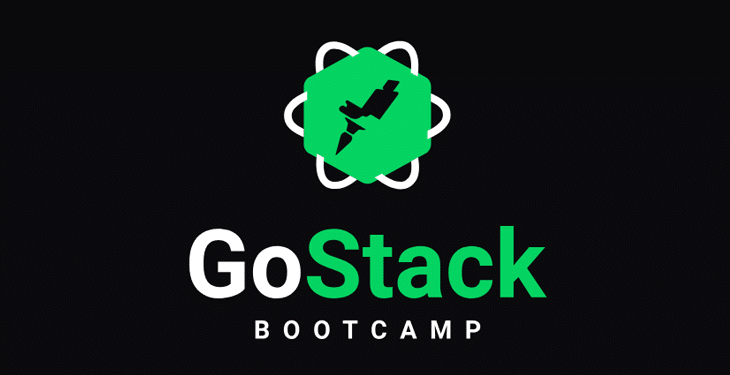

<p align="center">
  <a href="" rel="noopener">
 </a>
</p>

<h3 align="center">GoStack Bootcamp</h3>

<div align="center">

[]()
[](https://github.com/kylelobo/The-Documentation-Compendium/issues)
[](https://github.com/kylelobo/The-Documentation-Compendium/pulls)
[](/LICENSE)

</div>

---

<p align="center"> 🚩 All bootcamp introductory codes and proposed challenges. They are React, React Native & Node.
    <br> 
</p>

## 📝 Table of Contents

- [About](#about)
- [Getting Started](#getting_started)
- [Languages](#languages)
- [Authors](#authors)
- [Acknowledgments](#acknowledgement)

## 🧐 About <a name = "about"></a>

Hi there, welcome to my repo where RocketSeat's introductory bootcamp codes, codes in ReactJS, React Native & NodeJS are stored.

Simple code, but not all start from the top. We are growing and perfecting ourselves to the best of our ability. Front-end is a passion and I am more and more in love.

## 🏁 Getting Started <a name = "getting_started"></a>

1. Clone this repo using

```
git clone git@github.com:wallyngson/GoStack-Bootcamp.git
```

2. Move yourself to the appropriate directory.
3. Run to install dependencies

```
yarn
```

### Prerequisites

Have yarn installed on your machine.

```
[yarn](https://yarnpkg.com/)
```
## ⛏️ Studied Languages <a name = "languages"></a>

- [ReactJS](https://pt-br.reactjs.org/) - Web Framework
- [React Native](https://reactnative.dev/) - Mobile Framework
- [NodeJs](https://nodejs.org/pt-br/) - Server Environment

## ✍️ Authors <a name = "authors"></a>

- [@wallyngson](https://github.com/wallyngson) - DEV Front-end & Student on RocketSeat.

## 🎉 Acknowledgements <a name = "acknowledgement"></a>

- @RocketSeat for this incredible teaching and in such a simple way
